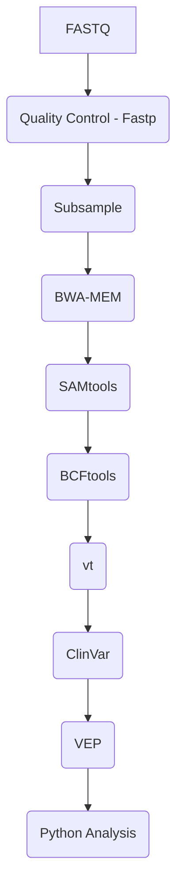

# Pipeline de Anotação de Variante (NGS)

Pipeline reprodutível para análise de variantes genômicas utilizando dados de sequenciamento de nova geração (NGS), desde o controle de qualidade das reads até a anotação funcional e clínica das variantes.

Todo o ambiente foi containerizado em Docker para garantir reprodutibilidade e consistência entre diferentes sistemas operacionais.

---

## Objetivo

Este projeto foi desenvolvido para implementar um pipeline completo de análise de variantes utilizando ferramentas amplamente empregadas em bioinformática.

O workflow contempla:

- Controle de qualidade das reads
- Alinhamento ao genoma de referência
- Processamento de arquivos BAM
- Chamada de variantes
- Normalização das variantes
- Anotação clínica e funcional
- Análise exploratória dos resultados em Python

Além da execução do pipeline, o projeto teve como foco compreender o propósito de cada etapa, interpretar os resultados produzidos e construir um fluxo reproduzível utilizando Docker.

---

## Tecnologias utilizadas

### Bioinformática

| Ferramenta | Finalidade |
|------------|------------|
| Fastp | Controle de qualidade e filtragem das reads |
| BWA-MEM | Alinhamento das reads ao genoma de referência |
| SAMtools | Conversão, ordenação e indexação de arquivos BAM |
| BCFtools | Chamada e manipulação de variantes |
| vt | Normalização e decomposição das variantes |
| Ensembl VEP | Predição do impacto funcional das variantes |
| ClinVar | Informações sobre relevância clínica das variantes |

### Infraestrutura

- Docker
- Miniconda
- Linux
- Bash

### Análise de dados

- Python
- Pandas
- Matplotlib

---

## Referência genômica

- Genoma de referência: **GRCh38**
- Cromossomo analisado: **20**

Para reduzir o tempo computacional e facilitar a reprodução do pipeline, foi utilizado apenas o cromossomo 20 como conjunto de dados de demonstração.

O genoma foi indexado utilizando:

- `samtools faidx`
- `bwa index`

---

# Workflow

```mermaid
graph TD
    A[FASTQ] --> B(Quality Control - Fastp)
    B --> C(Subsample)
    C --> D(BWA-MEM)
    D --> E(SAMtools)
    E --> F(BCFtools)
    F --> G(vt)
    G --> H(ClinVar)
    H --> I(VEP)
    I --> J(Python Analysis)
```

---

# Resultados

Após a execução do pipeline foram identificadas **3.133 variantes** no cromossomo 20.

As variantes passaram por anotação clínica (ClinVar) e funcional (VEP), permitindo avaliar tanto sua relevância clínica quanto seu possível impacto biológico.

## Registro clínico

| Classificação | Quantidade |
|--------------|-----------:|
| Total de variantes | 3133 |
| Com registro no ClinVar | 47 |
| Sem registro clínico | 3086 |

Entre as variantes registradas:

| Classificação | Quantidade |
|--------------|-----------:|
| Benign | 24 |
| Likely benign | 10 |
| Uncertain significance | 10 |
| Benign / Likely benign | 2 |
| Conflicting classifications | 1 |

A maior parte das variantes registradas possui classificação **benigna**, indicando ausência de associação conhecida com doenças.

---

## Impacto funcional

Segundo a anotação realizada pelo Ensembl VEP:

- 100% das variantes receberam classificação **MODIFIER**

Isso indica que as variantes identificadas estão predominantemente localizadas em regiões não codificantes ou apresentam impacto funcional baixo ou ainda desconhecido.

Nenhuma variante foi classificada como **HIGH** ou **MODERATE**.

---

## Distribuição genômica

A distribuição das variantes ao longo do cromossomo mostrou cobertura em praticamente toda sua extensão, com maior concentração próxima à região de **30 Mb**.

Essa concentração pode estar relacionada à cobertura do sequenciamento ou à maior densidade de variantes naquela região.

---

## Principais competências demonstradas

Este projeto demonstra experiência prática em:

- Desenvolvimento de pipelines em Bioinformática
- Linux e linha de comando
- Docker para reprodutibilidade
- Processamento de arquivos FASTQ, BAM e VCF
- Variant Calling
- Anotação funcional de variantes
- Interpretação de resultados de NGS
- Organização de workflows reproduzíveis
- Análise de dados em Python

---

## Próximos passos

- Automatização completa do pipeline com Bash
- Geração automática de relatórios
- Implementação de workflow utilizando Nextflow ou Snakemake
